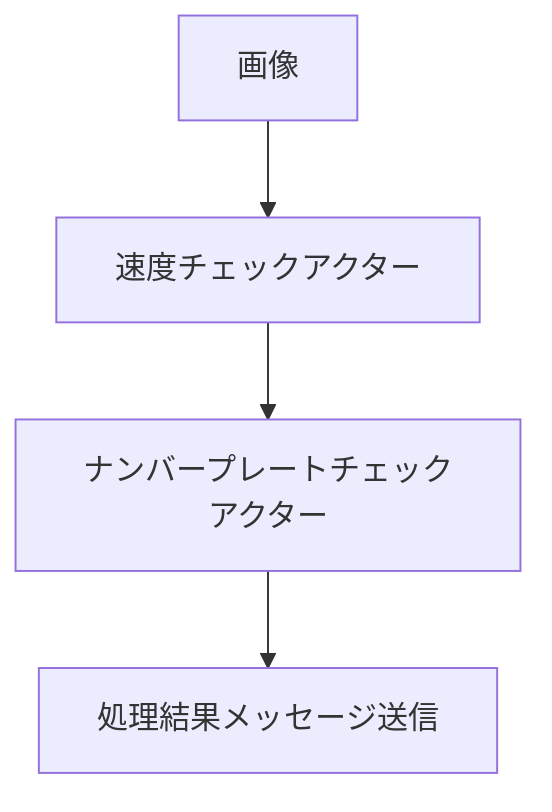
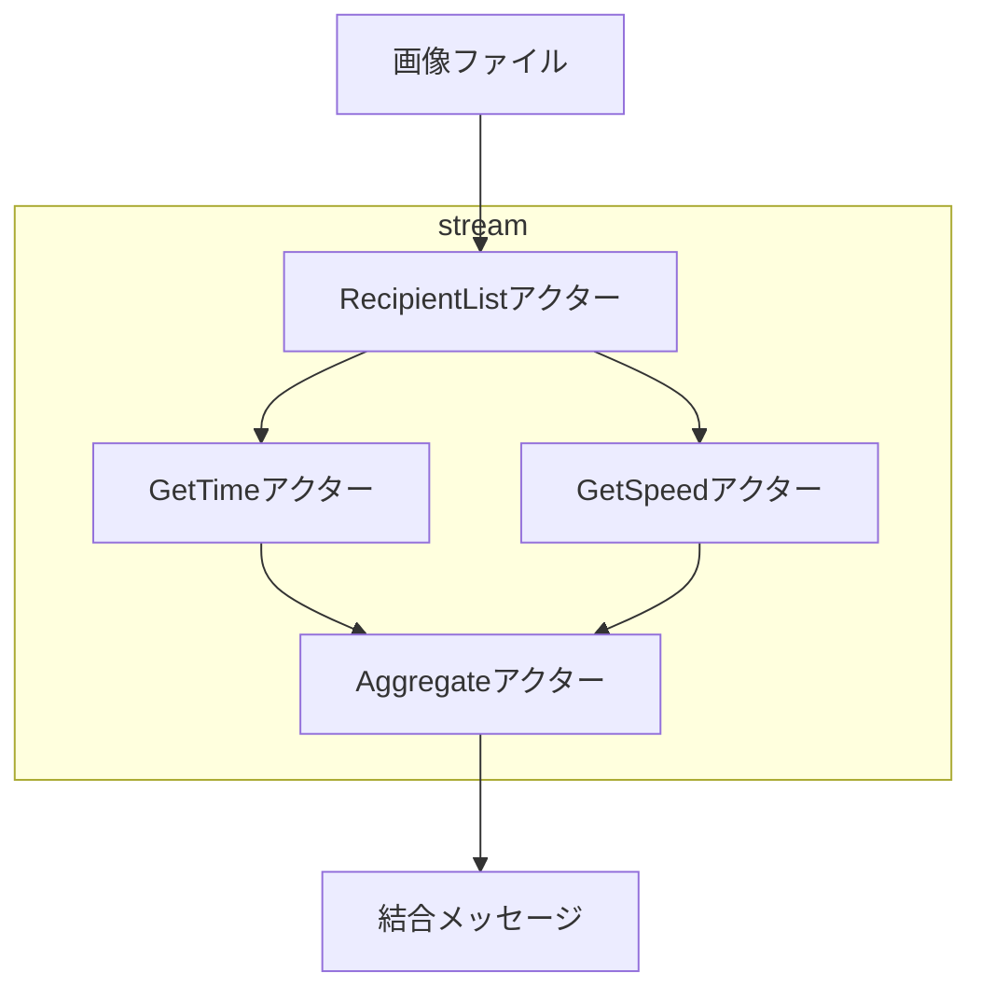

# アクターの構造パターン

## 概要

エンタープライズインテグレーションパターンの一つである、アクターの構造パターンについて学ぶサンプルです。  

| dir                              |                |
|:---------------------------------|:---------------|
| [filter](./filter)               | パイプ・フィルターパターン  |
| [scattergather](./scattergather) | スキャッターギャザーパターン |

## パイプ・フィルターパターン

車の制限速度のチェックを例にしたものです

パイプ・フィルターパターンは一般的なフィルター処理と同じです。

## スキャッターギャザーパターン

このサンプルでは、写真から時間と速度を求める処理を例にしています。  
時間のみを取得するアクターと、速度のみを取得するアクターを並列に起動し、  
結果を集約するアクターを起動します。  
スキャッターギャザーパターンでは処理を分散して、結果を集約することができます。

例えば複数のデータソースなどから最安値や最高値を求める処理など、  
並列で複数の要素から何かを判断する、加工するような処理に有効です。
